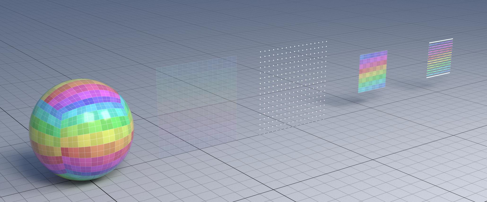
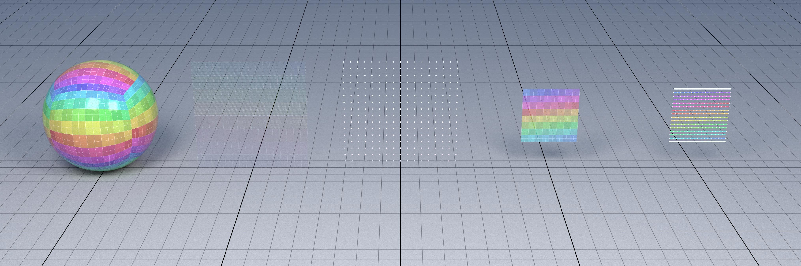
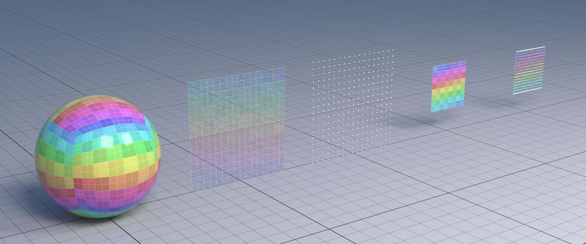
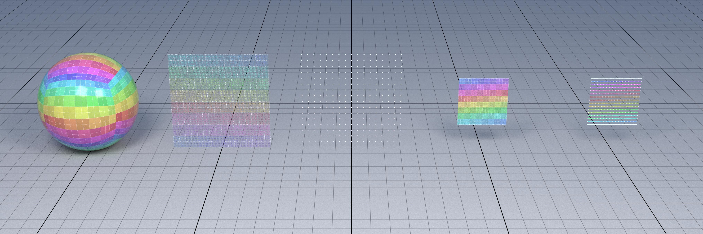
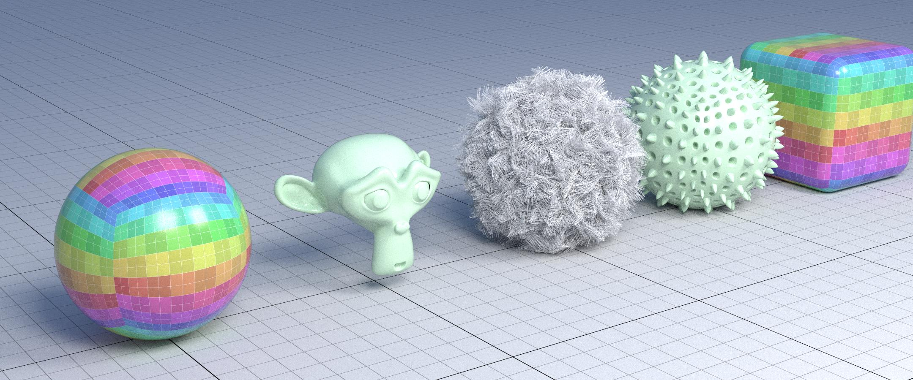
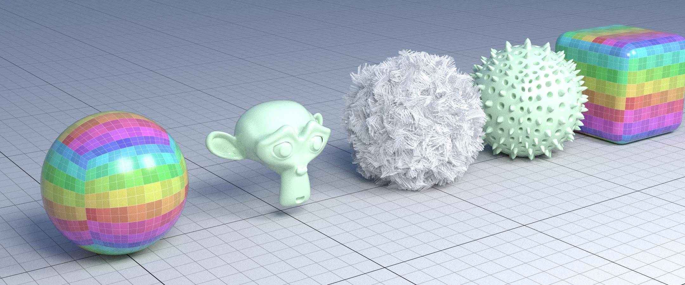
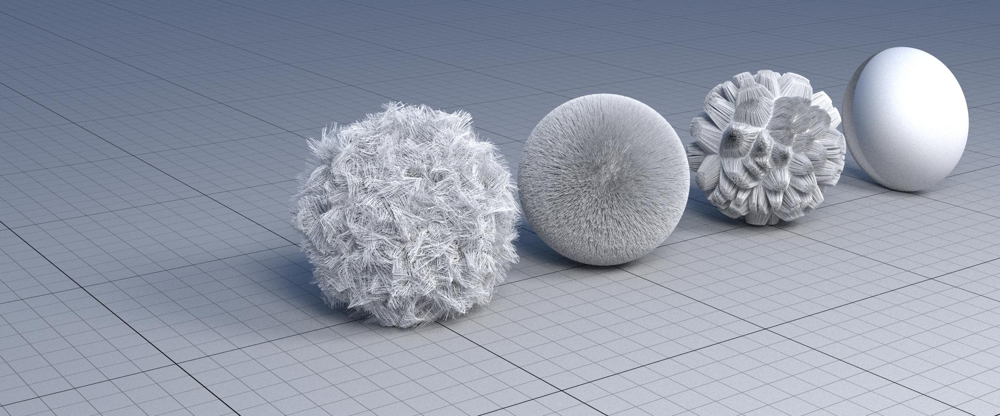
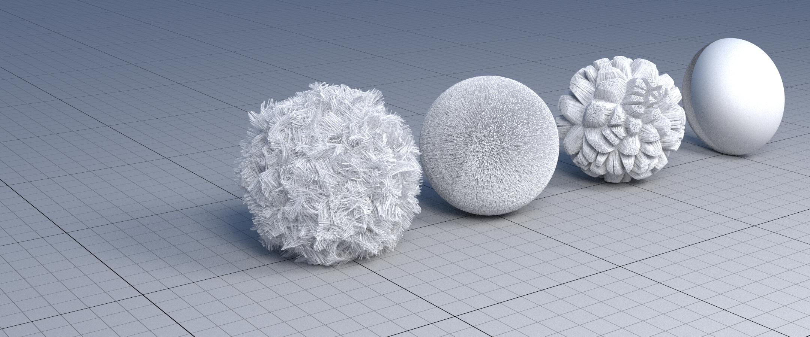

Projects for the Course Foundation of Computer Graphics
=======================================================


Projects: Rendering Systems
---------------------------

* **Intersection Primitives**: 1 person in C++
  * the rendering of points, lines and quads is now too approximate; in this project we will compute these intersections accurately
  * render points as spheres and lines as capped cones; intersection algorithms can be found [here](https://iquilezles.org/www/articles/intersectors/intersectors.htm) with names Sphere and Rounded Cone
  * render quads as bilinear patches as shown [here](https://research.nvidia.com/publication/2019-03_cool-patches-geometric-approach-raybilinear-patch-intersections)
  * to integrate them in our code you have to (a) insert the new intersection functions in `intersect_bvh` in `yocto_bvh`, (b) change the functions `eval_position` e `eval_normal` to compute the new position and normal, or (c) change the data to return the intersection normal and position directly from the intersection call
  * make test files that show the difference between the methods (I would put a flag inside shapes that switches the intersection methods)

More info at [`markdown/project_guideline.md`](markdown/project_guideline.md).


## Test Results

Tests are divided by **vanilla** (points as points, lines as lines, and quads as quads) and **enhanced** (points as spheres, lines as rounded cones, and quads as bilinear patches).

The complete folder with all the tests is [`test`](test/).

To execute a test, you can perform (inside [`yocto-gl`](yocto-gl/) folder):

```bash
./bin/ytrace --scene "test/file/path"  --output out/file/path --sampler path --samples 256 --resolution 4060 --bounces 8 --camera front
```

add `--points --lines --quads` to change the intersection mode to **enhanced**, or add `--intersection` to use the normal calculated in `eval_normal()`, instead of using the normal calculated in the intersection primitive functions.

If you want to see the render in real type add `--interactive` in the CLI command.

A general guide with major changes in the code is available in [`markdown/ste-by-step_guide.md`](markdown/step-by-step_guide.md), all change of the code are marked with the comment `// MY CODE`.

### Shapes 4 

The image is composed of five objects, starting from the left, a sphere composed of bilinear patches, a point grid, a thick point grid (thus composed of spheres as primitives), a line grid, and finally a thick line grid (thus composed of Rounded Cone as primitives).

#### Vanilla


- samples: 1024, resolution: 2160, bounce: 8.



- samples: 256, resolution: 4060, bounce: 8.

```bash
./bin/ytrace --scene tests/_version43/materials4/materials4.json  --output out/materials4_vanilla.jpg --sampler path --samples 256 --resolution 4060 --bounces 8 --camera front
```

#### Enhanced



- samples: 1024, resolution: 2160, bounce: 8.



- samples: 256, resolution: 4060, bounce: 8.

```bash
./bin/ytrace --scene tests/_version43/materials4/materials4.json  --output out/materials4_enanched.jpg --sampler path --samples 256 --resolution 4060 --bounces 8 --camera front --point --lines --quads
```


### Features 2

The image consists of five objects, starting from the left, a sphere composed of bilinear patches, a monkey head also composed of bilinear patches, a hairball composed of Rounded Cone like primitives, a sphere of spikes, and finally a rounded cube.

#### Vanilla



* samples: 256, resolution: 2160, bounce: 8.

```bash
./bin/ytrace --scene tests/features2/features2.json  --output out/features2_vanilla.jpg --sampler path --samples 256 --resolution 4060 --bounces 8
```

#### Enhanced



* samples: 256, resolution: 2160, bounce: 8.

```bash
./bin/ytrace --scene tests/features2/features2.json  --output out/features2_enhanced.jpg --sampler path --samples 256 --resolution 4060 --bounces 8 --camera front --point --lines --quads
```


### Shapes 3
The image is composed of four different hairball.

#### Vanilla



* samples: 256, resolution: 2160, bounce: 8.

```bash
./bin/ytrace --scene tests/_version43/shapes3/shapes3.json  --output out/shapes3_vanilla.jpg --sampler path --samples 256 --resolution 4060 --bounces 8
```

#### Enhanced



* samples: 1024, resolution: 2160, bounce: 8.

```bash
./bin/ytrace --scene tests/_version43/shapes3/shapes3.json --output out/shapes3_enhanced.jpg --sampler path --samples 256 --resolution 4060 --bounces 8 --point --lines --quads
```
